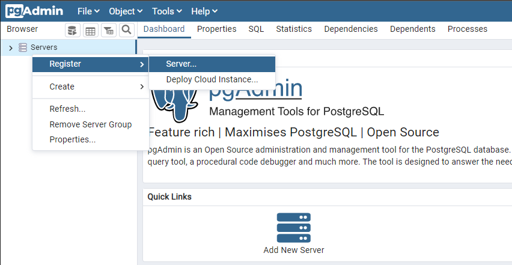
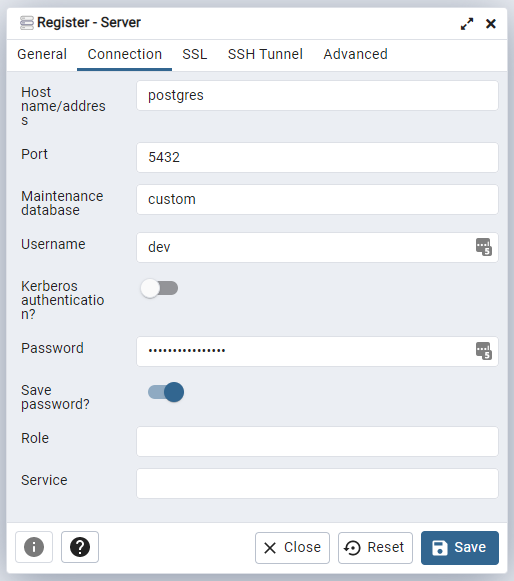
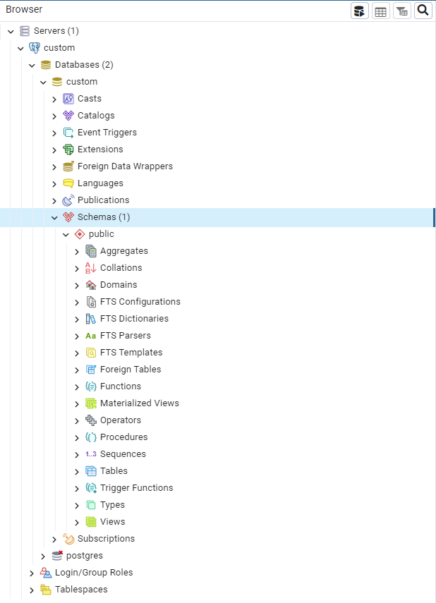

# Docker PostgreSQL and pgAdmin

## Requirements

- Docker

Follow deployment instructions below.

## Development
Open the terminal and create the ``.env`` from the ``.env.dev``:
```
cp .env.dev .env
```

Run containers:
```
docker compose up -d
```

Open pgAdmin in your browser: http://localhost:8080 and login with:

- Email Address: `dev@custom.com`
- Password: `G15cudczvtrlqTg7`

> You can change username, password and database name in [.env](.env).

Register a new server:



Set the server name (General tab) and connection parameters (Connection tab):



Database should be available in the left panel:

